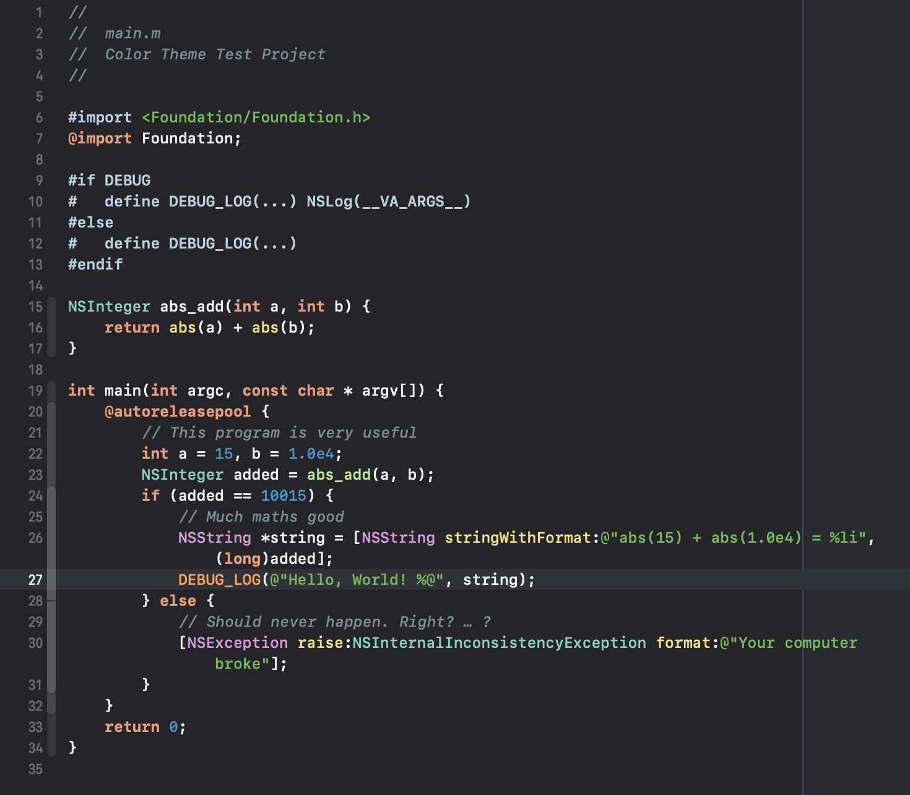

# xcode-sunburst-theme

## Sunburst.tmTheme adapted to an Xcode text editor theme

I love the Sunburst TextMate theme for its use of contrasting, mostly cool colors, ideal for quick skimming without being overly gaudy or unreadably soft.

In adapting it to an Xcode editor theme, I shifted some colors around, and came up with a few new ones for syntactic elements unique to Xcode. For example, all name declarations are light blue and italicized (the original only does this to class names), and references to project-defined names are different shades of green.

I also took some cues from Xcode's default themes and applied a heavier font weight to keywords. This along with the bright orange color (from which I would like to think Sunburst derives its name) really lifts the keywords off the page and helps for quick code structure scans.

This is the theme that I actually use when I use Xcode, and I highly recommend it ;)

## Preview

(This is a screenshot from Xcode 10, in which declaration names cannot be highlighted. In Xcode 11+, declaration names are highlighted light blue and italicized.)

(Yes, this is Objective-C code, but I love this theme just as much, perhaps even more, when applied to Swift code.)

## Install

Download [`Sunburst.xccolortheme`](Sunburst.xccolortheme) and stick it in `~/Library/Developer/Xcode/UserData/FontAndColorThemes`, then select Sunburst in Xcode Fonts & Colors preferences.
